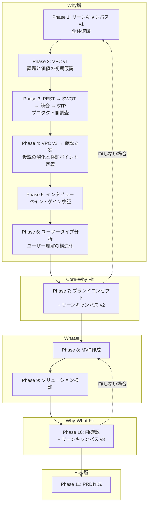

# discovery-workflow

プロダクトの「誰に・何を・なぜ」を検証するディスカバリーフェーズを、Claude Code上で対話的に進めるプラグインです。

10種のフレームワークをテンプレートに沿って対話的に作成でき、作成したドキュメントはMiroボードへワンコマンドで自動転記できます。各フレームワークには実例（架空の料理レシピ共有アプリ「CookPal」）を同梱しており、初めてでもイメージを掴みやすくなっています。

## すぐに使う

新しいプロダクト企画？ → `/lean-canvas`
顧客の課題を整理？ → `/vpc`
市場環境を分析？ → `/pest`
インタビュー準備？ → `/interview`
全体の進め方を確認？ → `/discovery-workflow`

## ワークフロー全体像

ディスカバリーは以下のPhaseを順に進めます。各Phaseに対応するスキルがあり、対話的にドキュメントを作成していきます。



`/discovery-workflow` で全体の進め方・判断基準を確認できます。

## インストール

マーケットプレイスを登録（初回のみ）：

```bash
/plugin marketplace add CHIHI913/cc-plugins
```

プラグインをインストール：

```bash
/plugin install discovery-workflow@cc-plugins
```

## スキル一覧（15スキル）

### フレームワーク作成（10スキル）

スキルを呼び出すと、テンプレートを読み込み、対話的に各セクションを埋めながらドキュメントを作成します。

| コマンド | フレームワーク | Phase |
|----------|--------------|-------|
| `/lean-canvas` | リーンキャンバス | 1, 7, 10 |
| `/vpc` | バリュー・プロポジション・キャンバス | 2, 4, 5 |
| `/pest` | PEST分析（政治・経済・社会・技術） | 3 |
| `/swot` | SWOT分析 + クロスSWOT戦略導出 | 3 |
| `/competitor` | 競合分析（Who-What-How + 機能比較） | 3 |
| `/stp` | STP分析（セグメンテーション・ターゲティング・ポジショニング） | 3 |
| `/hypothesis` | 仮説立案（体系的整理 + 検証ポイント定義） | 4 |
| `/interview` | インタビュースクリプト作成 | 5, 9 |
| `/user-type` | ユーザータイプ分析（2軸4象限分類） | 6 |
| `/brand-concept` | ブランドコンセプト（世界観・約束・提供価値の統合） | 7 |

### Miro自動転記（4スキル）

Markdownで作成したドキュメントをMiroボード上のテンプレートフレームに付箋として自動配置します。ラベルに応じた色分け、アンカー座標の自動検出、レイアウト最適化を行います。

| コマンド | 使い方 |
|----------|--------|
| `/lean-canvas-to-miro` | `file:<ファイルパス> board_url:<MiroフレームURL>` |
| `/vpc-to-miro` | `file:<ファイルパス> board_url:<MiroフレームURL>` |
| `/pest-to-miro` | `file:<ファイルパス> board_url:<MiroフレームURL>` |
| `/swot-to-miro` | `file:<ファイルパス> board_url:<MiroフレームURL>` |

### ワークフローガイド（1スキル）

| コマンド | 概要 |
|----------|------|
| `/discovery-workflow` | 全Phaseの目的・進め方・アウトプット・判断基準を確認 |

## 使い方の例

### 1. ワークフロー全体を確認

```
/discovery-workflow
```

Phase一覧と各Phaseの目的・判断基準が表示されます。

### 2. リーンキャンバスを作成

```
/lean-canvas
```

保存先パスを聞かれるので指定すると、テンプレートに沿って9要素を対話的に埋めていきます。

### 3. 作成したリーンキャンバスをMiroに転記

```
/lean-canvas-to-miro file:path/to/lean-canvas.md board_url:https://miro.com/app/board/xxx/?moveToWidget=yyy
```

Miroボード上のテンプレートフレームに付箋として自動配置されます。

## なぜこのプラグイン？

汎用AIに「リーンキャンバスを作って」と頼むと、それっぽいテキストが出てきます。でも実際のディスカバリーでは、フレームワーク間の整合性、仮説の検証状況の追跡、ドキュメントのバージョン管理が必要です。

このプラグインは：

- **ワークフローとして統合** — 各フレームワークが次のPhaseにどうつながるか定義済み
- **仮説の状態管理** — 📗検証済み / 📘事実 / 💡仮説のラベルで、どの情報が確認済みでどれが未検証かを可視化
- **バージョニング** — VPCはv1→v2→v3...とインタビューのたびに更新。リーンキャンバスもPhaseごとにv1→v2→v3
- **Miro連携** — 作成したMarkdownをワンコマンドでMiroボードに付箋として自動配置

## 前提条件

- [Claude Code](https://docs.anthropic.com/en/docs/claude-code) がインストール済みであること

### Miro連携を使う場合

以下の環境変数を設定してください：

```bash
export MIRO_ACCESS_TOKEN="your-access-token"
export MIRO_REFRESH_TOKEN="your-refresh-token"
export MIRO_CLIENT_ID="your-client-id"
export MIRO_CLIENT_SECRET="your-client-secret"
```

トークンは [Miro Developer Portal](https://developers.miro.com/) で取得できます。401エラー時にはリフレッシュトークンで自動更新されます。

## ディレクトリ構造

```
discovery-workflow/
├── .claude-plugin/
│   └── plugin.json                # プラグインマニフェスト
├── scripts/                       # Miro連携用Pythonスクリプト
├── skills/
│   ├── discovery-workflow/        # ワークフロー全体ガイド
│   │   ├── SKILL.md
│   │   └── references/
│   ├── lean-canvas/               # フレームワーク（10種 × 同構成）
│   │   ├── SKILL.md               #   ガイド + 対話的作成フロー
│   │   ├── references/
│   │   │   ├── template.md        #   テンプレート
│   │   │   └── guide.md           #   詳細ガイド
│   │   └── examples/
│   │       └── example.md         #   CookPalサンプル
│   ├── vpc/
│   ├── ...
│   ├── lean-canvas-to-miro/       # Miro連携（4種）
│   │   └── SKILL.md
│   └── ...
└── README.md
```

## License

MIT
