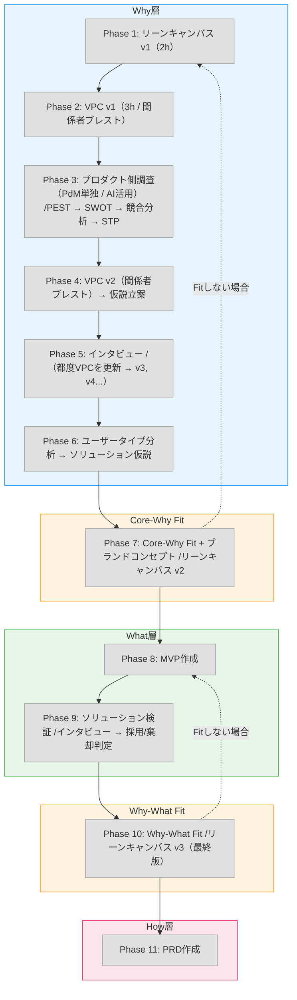

# ディスカバリーワークフロー Phase詳細

## 全体フロー

## Phase 1: 全体俯瞰

### リーンキャンバス v1

| 項目 | 内容 |
|------|------|
| **目的** | プロダクトの仮説を1枚で俯瞰する |
| **所要時間** | 2h |
| **進め方** | 自然に思いついた順序で書く。完璧を目指さない |
| **アウトプット** | リーンキャンバス v1（9要素すべて記入。すべて仮説でOK） |
| **次へ進む基準** | 9要素が埋まっている。空白があっても「？？？」で明示されている |

> 詳細は `/lean-canvas` スキルを参照

## Phase 2: 初期仮説構築

### VPC v1

| 項目 | 内容 |
|------|------|
| **目的** | ユーザーの課題と価値提案の初期仮説を構築する |
| **所要時間** | 3h |
| **進め方** | **関係者とブレスト**しながら作成。右側（Customer Profile）から先に書く |
| **アウトプット** | VPC v1（Customer Profile + Value Map）。全項目（仮説）でOK |
| **次へ進む基準** | 対象セグメントの仮説が持てている状態 |

**ポイント**: この段階ではまだ検証していない。仮説ベースで「このセグメントを深掘りする」という方向性を持つことが目的。

> 詳細は `/vpc` スキルを参照

## Phase 3: プロダクト側調査

**PdMが1人で実施。AIを活用して素早く進める。**

### Step 1: PEST分析

| 項目 | 内容 |
|------|------|
| **目的** | 外部環境の変化を整理し、SWOTのO/Tにインプットする |
| **進め方** | AIで調査。必要に応じてディープリサーチも活用 |
| **アウトプット** | PEST要因評価（確実性x影響度）+ 各要因のプロダクトへの示唆 |
| **次へ進む基準** | 各要因に定量データと「プロダクトへの示唆」が書かれている |

> 詳細は `/pest` スキルを参照

### Step 2: SWOT分析

| 項目 | 内容 |
|------|------|
| **目的** | 内部環境（S/W）と外部環境（O/T）を整理し、4つの戦略方向性を導出する |
| **進め方** | PEST結果をO/Tに転記。S/Wは自社の棚卸し。AIで素早くドラフト |
| **アウトプット** | SWOTマトリクス + クロスSWOT（積極/改善/差別化/防衛）+ 示唆 |
| **次へ進む基準** | 各要素に裏付けがある。クロスSWOTで戦略方向性が見えている |

> 詳細は `/swot` スキルを参照

### Step 3: 競合分析

| 項目 | 内容 |
|------|------|
| **目的** | 競合のWho-What-Howを分析し、自社の独自性・差別化・Gapを特定する |
| **進め方** | AIで素早くドラフト作成し、人間が調整 |
| **アウトプット** | 競合リスト + Who-What-How分析 + 機能比較マトリクス + 差別化分析 |
| **次へ進む基準** | 直接競合と代替品の両方を網羅。自社の独自性が特定できている |

> 詳細は `/competitor` スキルを参照

### Step 4: STP分析

| 項目 | 内容 |
|------|------|
| **目的** | ターゲットセグメントを選定し、差別化ポジションを明確にする |
| **進め方** | S（セグメンテーション）とT（ターゲティング）は必須で埋める。**P（ポジショニング）はインタビュー後に確定することもあるため、この段階では任意** |
| **アウトプット** | セグメントマップ + 6R評価 + ターゲット選定（+ ポジショニングマップは任意） |
| **次へ進む基準** | 6R評価でターゲットセグメントが選定できている |

> 詳細は `/stp` スキルを参照

## Phase 4: 仮説深化

### VPC v2

| 項目 | 内容 |
|------|------|
| **目的** | プロダクト側調査の結果を踏まえ、VPCの仮説を深化させる |
| **進め方** | **関係者とブレスト**しながら。PEST/SWOT/競合/STPの知見をValue Mapに反映 |
| **アウトプット** | VPC v2（Deep Dive: 事実→分析→戦略→提案を充実） |
| **次へ進む基準** | 検証すべき仮説が明確になっている |

> 詳細は `/vpc` スキルを参照

### 仮説立案

| 項目 | 内容 |
|------|------|
| **目的** | VPC v2の仮説を体系的に整理し、検証ポイントを定義する |
| **進め方** | 仮説項目を一覧化。各仮説に検証方法・対応設問・判定基準を設定 |
| **アウトプット** | 仮説一覧 + 検証ポイント定義（仮説x検証方法x判定基準） |
| **次へ進む基準** | 各仮説にインタビュースクリプトのどの設問で検証するかが紐付いている |

> 詳細は `/hypothesis` スキルを参照

## Phase 5: ペイン・ゲイン検証

### インタビュー

| 項目 | 内容 |
|------|------|
| **目的** | 仮説立案で定義した検証ポイントをインタビューで検証する |
| **進め方** | インタビュースクリプトを作成→実施。1セグメント5〜10名 |
| **アウトプット** | インタビュー記録 x 人数分 |
| **次へ進む基準** | 判定基準（N名中M名が言及したら支持）に基づき各仮説を判定 |

**重要**: インタビュー中に新たな仮説やファクトとして確定させてよいものが見つかれば、**都度VPCのバージョンを更新**する（v3, v4...）。インタビューとVPC更新は一体で進める。

> 詳細は `/interview` スキルを参照

## Phase 6: ユーザー理解の構造化

### ユーザータイプ分析

| 項目 | 内容 |
|------|------|
| **目的** | インタビュー結果から、ユーザーのニーズやジョブが変わる軸でタイプを分類する |
| **進め方** | 行動・態度の2軸で4象限に分類。タイプごとにソリューション仮説を分ける |
| **アウトプット** | ユーザータイプマップ + 各タイプ詳細 + ソリューション仮説 |
| **次へ進む基準** | 各タイプに対する異なるソリューション仮説が立てられている |

**ポイント**: このタイミングでSTPのP（ポジショニング）を確定させる。インタビュー結果を踏まえた上でポジショニングマップを描く。

> 詳細は `/user-type` スキルを参照

## Phase 7: Core-Why Fit + ブランドコンセプト

Why層の全検討が完了した段階で、Coreとの整合性を確認し、ブランドコンセプトの策定に入る。ブランドコンセプトの策定過程でもCoreを考え直すため、このフェーズで合わせて実施する。

### リーンキャンバス更新 → v2

Why層（プロダクト側＋ユーザー側）の完了。リーンキャンバスのCore/Why部分を更新する。

**更新箇所**: 課題（検証済み/棄却）、カスタマーセグメント（STPで精緻化＋インタビューで確定）、UVP（検証結果に基づき修正）、圧倒的な優位性（SWOTから）、既存の代替品（競合分析から）。

> リーンキャンバスの作成・更新は `/lean-canvas` スキルを参照

### Core-Why Fit確認

Whyの検討結果がCore（ビジョン）と整合しているかを確認する。ビジョンを忘れてユーザーの声だけを聞き続けると、プロダクトが発散する。Whyはビジョンを達成するための手段であることを忘れない。

**Refineのトリガー**:
- インタビューで想定と異なる反応が出た（ターゲットや課題の前提が崩れた）
- 競合状況が変化した
- ステークホルダーとの議論で方向性が変わった

**Fitしない場合**:
- Whyの方向性を修正する（ターゲットや課題定義を見直す）
- またはCoreを見直す（ビジョン自体のRefineが必要な場合）

**重要**: スケジュールより仮説検証を優先する。検証で仮説が覆った場合は前のフェーズに戻ってRefineする。

### ブランドコンセプト

| 項目 | 内容 |
|------|------|
| **目的** | ディスカバリーの全成果を統合し、プロダクトの世界観・約束・提供価値を1つのドキュメントにまとめる |
| **進め方** | v1を作成 → ステークホルダーと議論 → バージョンを上げていく。策定過程でCoreの見直しも行う |
| **アウトプット** | 背景 + ターゲット + プロミス + コアバリュー（ファクト/仮説テーブル付き）+ ブランドパーソナリティ |
| **次へ進む基準** | 上から順に確定（背景→ターゲット→プロミス→コアバリュー）。ステークホルダーの合意 |

> 詳細は `/brand-concept` スキルを参照

## Phase 8: MVP作成

| 項目 | 内容 |
|------|------|
| **目的** | ソリューション仮説をMVPとして具体化する（What層の設計） |
| **進め方** | Phase 6のソリューション仮説をもとにMVPを作成 |
| **アウトプット** | MVP |
| **次へ進む基準** | ソリューション仮説の検証ポイントが設定されている |

## Phase 9: ソリューション検証

| 項目 | 内容 |
|------|------|
| **目的** | MVPをユーザーに使ってもらい、ソリューション仮説を検証する |
| **進め方** | インタビュースクリプト作成 → ユーザーにMVPを使ってもらい行動・発言を観察 → 採用/棄却判定 |
| **アウトプット** | ソリューション検証結果（採用/棄却判定 + 改善点） |
| **次へ進む基準** | 事前に決めたソリューション仮説の検証ポイントをクリアしたら完了 |

> インタビュースクリプトの作成は `/interview` スキルを参照

## Phase 10: Why-What Fit

What層（ソリューション検証）が完了した段階で、WhyとWhatの整合性を確認する。Whatの検討中はWhyを忘れがちになる。VPCの「誰をどんな状態にしたいか」に立ち返る。

| 項目 | 内容 |
|------|------|
| **目的** | 検証済みのソリューション（What）がWhy（課題・ターゲット）と整合しているか確認する |
| **確認観点** | ソリューションがWhyの課題を解決しているか。SWOTの戦略方向性と矛盾していないか。ブランドコンセプトと整合しているか |
| **アウトプット** | Fit確認結果。必要に応じてRefine |
| **次へ進む基準** | Core-Why-Whatの3層が一貫したストーリーになっている |

**Refineのトリガー**:
- ソリューション検証で仮説が棄却された
- 検証結果がWhyと矛盾している
- ステークホルダーとの議論で方向性が変わった

**Fitしない場合**:
- ソリューションを修正する（MVPの改善・ピボット）
- またはWhyに戻る（課題定義やターゲットの見直しが必要な場合）

### リーンキャンバス更新 → v3（最終版）

What層を確定し、リーンキャンバスに反映する。

**更新箇所**: ソリューション（MVP結果反映）、主要指標（確定）、チャネル、コスト構造、収益の流れ。

> リーンキャンバスの作成・更新は `/lean-canvas` スキルを参照

**重要**: スケジュールより仮説検証を優先する。

## Phase 11: PRD作成（How層）

MVPの採用/棄却判定と改善点をまとめ、市場投入するためのPRDを作成する。PRDはHow層のドキュメントであり、「実際のプロダクトをどのようにつくり上げるか」を定義する。ブランドコンセプト（Phase 7で策定済み）の内容もPRDに反映する。

## 関連スキル一覧

| フェーズ | スキル | コマンド |
|----------|--------|----------|
| Phase 1, 7, 10 | リーンキャンバス | `/lean-canvas` |
| Phase 2, 4, 5 | バリュー・プロポジション・キャンバス | `/vpc` |
| Phase 3 Step 1 | PEST分析 | `/pest` |
| Phase 3 Step 2 | SWOT分析 | `/swot` |
| Phase 3 Step 3 | 競合分析 | `/competitor` |
| Phase 3 Step 4 | STP分析 | `/stp` |
| Phase 4 | 仮説立案 | `/hypothesis` |
| Phase 5, 9 | インタビュー | `/interview` |
| Phase 6 | ユーザータイプ分析 | `/user-type` |
| Phase 7 | ブランドコンセプト | `/brand-concept` |
| Miro連携 | PEST → Miro | `/pest-to-miro` |
| Miro連携 | SWOT → Miro | `/swot-to-miro` |
| Miro連携 | VPC → Miro | `/vpc-to-miro` |
| Miro連携 | リーンキャンバス → Miro | `/lean-canvas-to-miro` |
