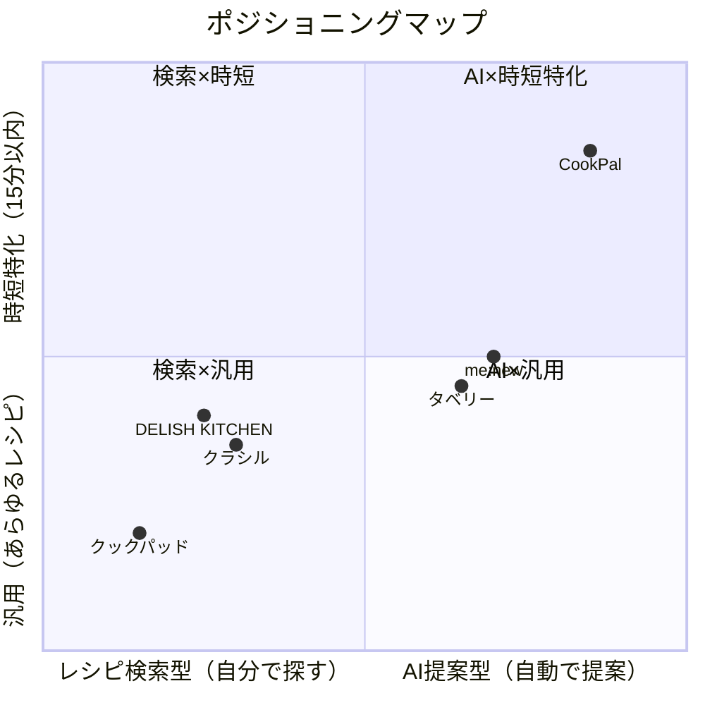

# STP分析（見本: CookPal）

## Segmentation（セグメンテーション）

| #   | セグメント              | 推計世帯数      | アプリ利用率  | 推定ユーザー数        | 主な課題             |
| --- | ------------------ | --------- | ------ | ------------ | ------------------ |
| 1   | 共働き×子育て世帯（未就学児） | 約300万世帯 | 35〜40% | 105〜120万人 | 栄養バランスと時短の両立、離乳食・幼児食対応 |
| 2   | 共働き×子育て世帯（小学生以上） | 約400万世帯 | 25〜30% | 100〜120万人 | 食べ盛りの量・好き嫌い対応、弁当作り |
| 3   | 共働き×DINKs（子なし） | 約500万世帯 | 20〜25% | 100〜125万人 | 献立のマンネリ化、自炊モチベーション維持 |
| 4   | 単身世帯（20〜30代） | 約700万世帯 | 15〜20% | 105〜140万人 | 自炊習慣の確立、1人分の食材使い切り |
| 5   | 単身世帯（40代以上） | 約600万世帯 | 5〜10% | 30〜60万人 | 健康管理、生活習慣病予防の食事 |
| 6   | シニア世帯（60代以上） | 約800万世帯 | 3〜5% | 24〜40万人 | 減塩・低カロリー、簡単調理 |
| 7   | 料理愛好家・上級者 | 約200万人 | 40〜50% | 80〜100万人 | 新しいレシピの発見、アレンジの共有 |
| 8   | 健康・ダイエット志向層 | 約500万人 | 20〜25% | 100〜125万人 | カロリー管理、栄養素管理、食事記録 |

合計: 推定ユーザー数 約650〜830万人

## Targeting（ターゲティング）

### 6R評価

| 評価基準 | 共働き×子育て（未就学児） | 共働き×子育て（小学生以上） | 共働き×DINKs | 単身（20〜30代） | 単身（40代以上） | シニア | 料理愛好家 | 健康志向層 |
|---------|:---:|:---:|:---:|:---:|:---:|:---:|:---:|:---:|
| **Rank**（優先度） | ◎ | ○ | ○ | △ | × | × | △ | ○ |
| **Realistic**（市場規模） | ○ | ○ | ◎ | ◎ | ○ | ○ | △ | ○ |
| **Reach**（到達可能性） | ◎ | ◎ | ○ | ○ | △ | × | ○ | ○ |
| **Response**（反応測定） | ◎ | ○ | ○ | ○ | △ | △ | ◎ | ○ |
| **Rate**（成長性） | ◎ | ○ | ○ | ○ | △ | △ | △ | ◎ |
| **Rival**（競合状況） | ○ | △ | ○ | × | ○ | ○ | × | △ |

### ターゲット選定

- セグメント: **共働き×子育て世帯（未就学児）**

**共働き×子育て世帯（未就学児）を選ぶ理由**
- 時短ニーズが最も切実（Rank◎）。離乳食・幼児食の栄養管理が加わり、献立の負荷が最大化する時期
- SNS・ママコミュニティ経由でリーチ可能（Reach◎）。育児系インフルエンサーやママ向けメディアとの親和性が高い
- 「実際に使って良かった」の口コミが広がりやすい（Response◎）。ママ友ネットワークによる自然拡散
- 共働き×子育て世帯は増加トレンド（Rate◎）。男性育休取得率向上で夫婦共同調理のニーズも拡大
- CookPalのAI食材認識×栄養バランス自動計算が最も価値を発揮するセグメント

**他セグメントを選ばない理由**
- 共働き×子育て（小学生以上）: ニーズはあるが、子どもが成長するにつれ時短の切実さが緩和（Rank○）。弁当レシピは競合が多い
- 共働き×DINKs: 市場規模は大きいが、外食・中食で代替しやすく定着率が低い。献立のマンネリ化は解決できるが、切実さが弱い
- 単身世帯（20〜30代）: 市場最大だが、自炊習慣がない層が多く定着が困難。UberEats等のデリバリーが強力な競合（Rival×）
- 単身世帯（40代以上）: デジタルリテラシーの壁があり到達困難（Reach△）
- シニア世帯: スマホアプリへの抵抗感が強い（Reach×）。到達・定着が困難
- 料理愛好家: 市場規模が小さく（200万人）、クックパッド等の既存サービスで十分（Rival×）
- 健康・ダイエット志向層: あすけん等の専門アプリが強力な競合（Rival△）

## Positioning（ポジショニング）

### ポジショニングマップ

- **横軸** レシピ検索型（自分で探す） ←→ AI提案型（自動で提案）
- **縦軸** 汎用（あらゆるレシピ）←→ 時短特化（15分以内）

### 各社ポジションの根拠

| サービス | 横軸の根拠 | 縦軸の根拠 |
|---------|----------|----------|
| ★CookPal | AI食材認識→レシピ自動提案。ユーザーは検索不要 | 全レシピ15分以内。時短に完全特化 |
| クックパッド | キーワード検索が主。400万件から自分で探す | 5分〜数時間まであらゆるレシピを網羅 |
| DELISH KITCHEN | カテゴリ・食材での検索が主。動画で確認 | 時短レシピもあるが汎用的。プロ監修の本格レシピも多数 |
| クラシル | カテゴリ検索+一部レコメンド。動画中心 | 1分動画で簡単そうに見せるが、実際の調理時間は30分以上も多い |
| me:new | AI献立自動作成。1週間分を提案 | 時短特化ではない。栄養バランス重視の汎用献立 |

### 差別化の方向性

- 右上（AI提案型 × 時短特化）の空白地帯を狙う
- 競合はすべて左側（レシピ検索型）に寄っており、AI提案型はme:new・タベリーが近いが時短特化ではない
- 「冷蔵庫を撮るだけで15分レシピが出てくる」というポジションは競合不在
