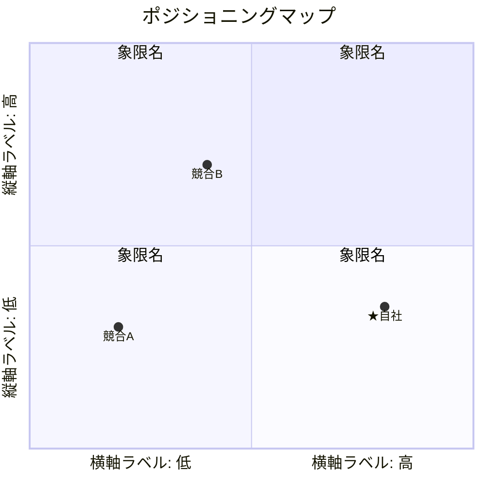

# STP分析

## Segmentation（セグメンテーション）

<!-- 市場をセグメントに分割し、推計人数・年間供給量で市場規模を定量化する -->

| # | セグメント | 推計人数 | 年間転職率 | 年間供給量 | 主な転職動機 |
|---|----------|---------|----------|-----------|------------|
| 1 |  |  |  |  |  |
| 2 |  |  |  |  |  |
| 3 |  |  |  |  |  |
| 4 |  |  |  |  |  |

合計: 約XX万人 / 年間供給量 約XX万人

## Targeting（ターゲティング）

<!-- 6Rで全セグメントを定量評価し、最も狙うべきセグメントを選定 -->

### 6R評価

| 評価基準 | セグメント1 | セグメント2 | セグメント3 | セグメント4 |
|---------|:---:|:---:|:---:|:---:|
| **Rank**（優先度） |  |  |  |  |
| **Realistic**（市場規模） |  |  |  |  |
| **Reach**（到達可能性） |  |  |  |  |
| **Response**（反応測定） |  |  |  |  |
| **Rate**（成長性） |  |  |  |  |
| **Rival**（競合状況） |  |  |  |  |

### ターゲット選定

- セグメント: **XXX**

**XXXを選ぶ理由**
-
-
-

**他セグメントを選ばない理由**
-
-

## Positioning（ポジショニング）

<!-- ターゲットにとって重要な評価基準 かつ 競合と差別化できる2軸でマップを描く -->

### ポジショニングマップ

- **横軸**
- **縦軸**

### 各社ポジションの根拠

| サービス | 横軸の根拠 | 縦軸の根拠 |
|---------|----------|----------|
| ★自社 |  |  |
| 競合A |  |  |
| 競合B |  |  |

### 差別化の方向性

<!-- ポジショニングマップ上で、自社が狙う空白地帯とその理由 -->

-
